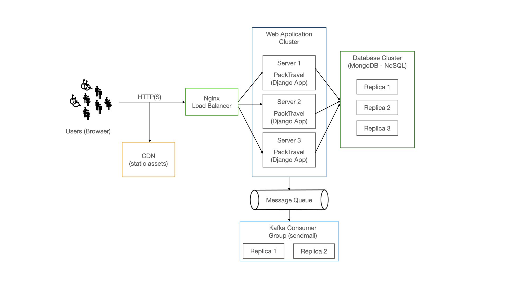

# 🐺 PackTravel

PackTravel is a web-application that connects people who want to carpool, share a cab or ride a bus together. Users can offer rides with their own vehicles, or travel together as a group in a cab or a bus. PackTravel helps you stay on a budget by reducing your travel expenses so that you don't have to miss out on that concert you've been wanting to attend 😉.

## 💎 Features
*   Users can create rides - personal vehicle, cab or taxi
*   Autocomplete for source and destination points
*   Users can send requests to join rides, cancel a ride request
*   Ride owners can accept requests from other riders to join rides, ride owners can delete their own rides
*   Forum for every ride to discuss logistics
*   Integration with Google Maps to show ride route , distance and duration.
*   Users can now get an estimated cab fare predicted with machine learning using date and time of the ride as attribute.
*   Users can set preferences in their profile
*   Created a feedback system for future analysis

## Watch the Demo Video

[Watch the video](https://github.com/TripleS-org/PackTravel_G29/raw/main/images/VIDEO-2024-11-01-20-28-18.mp4)

## 👥 Audience
Any person who is looking to reduce spending on their commute expenditure can use our application.

## ⚒️ Deployment and Installation
*   PackTravel is built using MongoDB Atlas database, Django (Python) for backend-services, and HTML/CSS/JS/Bootstrap for the front-end.
*   The application can be deployed on any web-server running on premise or in the cloud. See [django deployment](https://docs.djangoproject.com/en/4.1/howto/deployment/) to setup django on a VM.
*   See [developer environment setup](INSTALL.md#--developer-environment-setup) to setup your development server.
*   Common issues faced by users while setting up the developer environment are listed [here](INSTALL.md#debugging).

## Scaling PackTravel

*   It is possible to scale PackTravel horizontally because of how we designed the application.
*   All APIs are stateless (REST); Therefore, any application server in a cluster can handle a request.
*   We can use a CDN such as Amazon S3, Cloudflare to serve static assets (images). This enables quicker load time as CDN servers are spread across geographic regions.
*   The bottleneck in PackTravel is the email sending feature. If we use a message queue such as Kafka to offload the task of sending an email to a different application (Kafka consumer), it will free our application server's resources quickly.
*   MongoDB is designed to handle large amounts of data and high levels of throughput. It can distribute data across multiple servers and process it in parallel. It has built-in support for sharding and this makes it easy to scale MongoDB horizontally by adding more servers as needed to handle the increased load.

## 🎯 Proposed Enhancements
*   Enable viewing of ride history in user account
*   Enable notifications if request is received accepted
*   Enable higher account security using 2FA

## 📨 Help and Troubleshooting
For any help or assistance regarding the software, please e-mail any of the developers with the query or a detailed description. Additionally, please use issues on GitHub for any software related issues, bugs or questions.

*   sspatil6@ncsu.edu
*   aspansar@ncsu.edu
*   aasatput@ncsu.edu

## Score Card
---
#### Total Grade: 145

| Factor | Score | Notes |
| --- | --- | --- |
| Video | 3 | Link Updated () |
| Workload | 3 | Distributed |
| Number of commits | 3 | 50+ |
| Number of commits: by different people | 3 | https://github.com/CSC510-SE-Fall2024/Team82-PackTravel/ |
| Issues report: There are many | 2 | https://github.com/CSC510-SE-Fall2024/Team82-PackTravel/ |
| Issues are being closed | 2 | https://github.com/CSC510-SE-Fall2024/Team82-PackTravel/pulse |
| DOI badge | 3 |  |
| Docs: format | 3 |  |
| Docs: description  | 3 |  |
| Docs: short animated video | 2 |  |
| Docs: strong punchlines | 3 |  |
| Docs: mini tutorials | 3 |  |
| Use of version control tools | 2 |  |
| Use of style checkers | 3 |  |
| Use of code formatters. | 3 |  |
| Use of syntax checkers. | 3 |  |
| Use of code coverage | 3 |  |
| Other automated analysis tools | 2 |  |
| Test cases exist | 3 |  |
| Test cases are routinely executed | 2 |  |
| The files http://contributing.md/ lists coding standards and lots of tips | 3 |  |
| Issues are discussed before they are closed | 3 |  |
| Chat channel: exists | 3 |  |
| Test cases: a large proportion of the issues related to handling failing cases. | 2 |  |
| Evidence that the whole team is using the same tools | 3 |  |
| Evidence that the members of the team are working across multiple places in the code base | 2 |  |
| Short release cycles | 3 |  |
| Does your website and documentation provide a clear, high-level overview of your software? | 3 |  |
| Does your website and documentation clearly describe the type of user who should use your software? | 3 |  |
| Do you publish case studies to show how your software has been used by yourself and others? | 3 |  |
| Is the name of your project/software unique? | 3 |  |
| Is your project/software name free from trademark violations? | 2 |  |
| Is your software available as a package that can be deployed without building it? | 3 |  |
| Is your software available for free? | 3 |  |
| Is your source code publicly available to download, either as a downloadable bundle or via access to a source code repository? | 3 |  |
| Is your software hosted in an established, third-party repository like GitHub? | 3 |  |
| Is your documentation clearly available on your website or within your software? | 3 |  |
| Does your documentation include a "quick start" guide, that provides a short overview of how to use your software with some basic examples of use? | 2 |  |
| If you provide more extensive documentation, does this provide clear, step-by-step instructions on how to deploy and use your software? | 3 |  |
| Do you provide a comprehensive guide to all your software’s commands, functions and options? | 3 |  |
| Do you provide troubleshooting information that describes the symptoms and step-by-step solutions for problems and error messages? | 3 |  |
| If your software can be used as a library, package or service by other software, do you provide comprehensive API documentation? | 3 |  |
| Do you store your documentation under revision control with your source code? | 2 |  |
| Do you publish your release history e.g. release data, version numbers, key features of each release etc. on your web site or in your documentation? | 3 |  |
| Does your software describe how a user can get help with using your software? | 3 |  |
| Does your website and documentation describe what support, if any, you provide to users and developers? | 3 |  |
| Does your project have an e-mail address or forum that is solely for supporting users? | 3 |  |
| Are e-mails to your support e-mail address received by more than one person? | 3 |  |
| Does your project have a ticketing system to manage bug reports and feature requests? | 2 |  |
| Is your project's ticketing system publicly visible to your users, so they can view bug reports and feature requests? | 3 |  |
